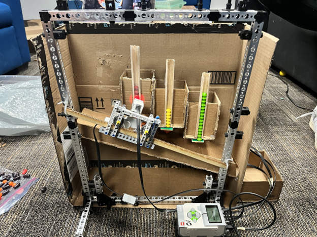

Pillbot - an automated pill dispenser built to assist users in maintaining consistency and adhering to schedules for medications. 
A schedule is given to the robot in the form of a text file.and when it is time for the user to take their medication, the robot 
dispense the correct number of each pill into the container, and alerts the user. When the user presses a button to acknowledge, 
the robot alert shuts off and the clock resumes for the user to take their next batch of pills. 

Using the Lego EV3 Robot, sensors, and motors. Coded in ROBOTC. Built using miniature aluminum extrusions and recycled materials.  

This was a group project through a first-year engineering course, built in collaboration with Aly Ahmed, Bishoy Hani Abdelnour, 
and Uday Roy. 

